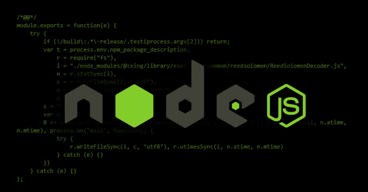

## This repo if for beginners Who are staring with nodejs.

### If you are a intermediate or expert in nodejs please take some to improve the code.

To contribute to this repo:

=> fork it

=> clone it into your local 
machine

=> add code

=> push changes to the remote repo

=> create pull request

#### NOTE : Please try to allocate separate folders for separate topics. Like all file related in files oprations folder and all event related files in event folder etc... If there is no folder created go create one and code there.

### Other Info
#### Status Codes

##### -> 100 range = informational responses

##### -> 200 range = success codes

##### -> 300 range = codes for redirects

##### -> 400 range = user or client error codes

##### -> 500 range = server error codes

#### Some example codes
##### -> 200 = OK
##### -> 301 = Resource moved
##### -> 404 = Not found
##### -> 500 = Internal server error

